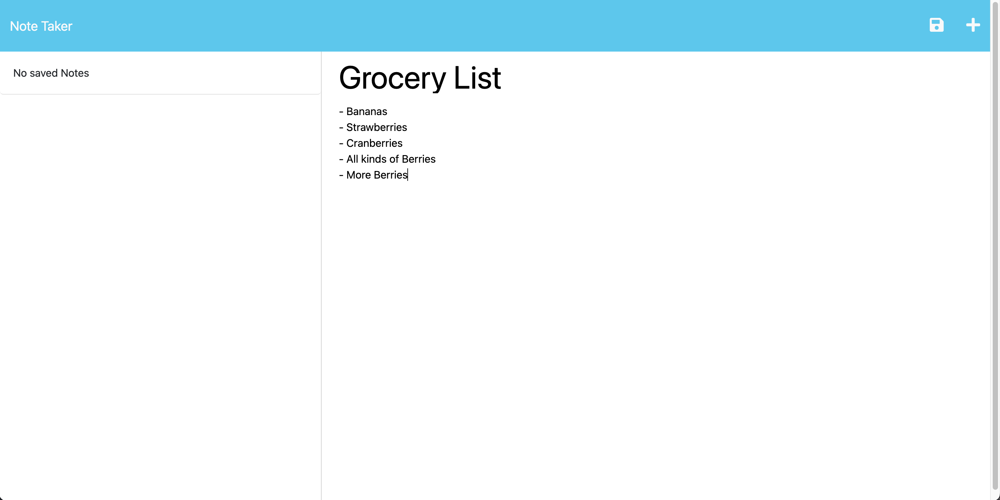
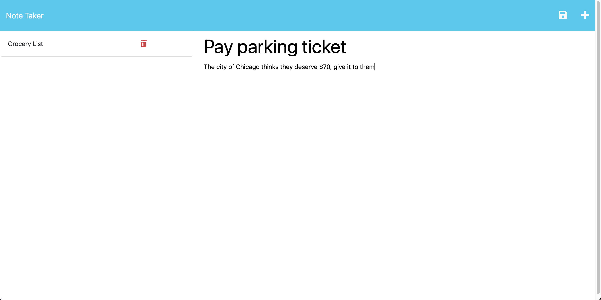

# express-note-taker

***<h1 style="text-align: center;">   </h1>***

## Description

The Purpose of this project was to generate all the backend routes in express.js to handle API calls to and from a JSON file. Following the requirements outlined in the provided user story, I had to create various HTML and API routes to get the application functioning.

Upon pressing "Get Started", you are redirected to the "Notes" page via a `GET` request. Then, you are able to type in a Note Title and Note Text. Once both of these fields have text within them, a save button will appear in the top right. Upon clicking the save button,the note is pushed into `db.json` via a `POST` request. Finally, it is displayed onto the left hand side of the page via a `GET` request.

Clicking the "Note Taker" title in the top left hand side will return you to the homepage via a `GET` request.

## Installation

The app is available online via [this heroku link](https://afternoon-shore-52649-757051be096a.herokuapp.com/). 

Alternatively, you can host it locally by using `git clone` or downloading the zip file. 
Upon downloading, run `npm i` for all of the necessary dependencies. `node server.js` will open it locally on port 3000. 

The port can be adjusted via line 8 of `server.js`.

## Usage

Enter the notes section by clicking "Get Started". Add your notes, hit save, and your note will persist in the database. To delete a note, hit the trash can icon to the left of it.

## Credits

[nanoid](https://www.npmjs.com/package/nanoid) - Random string generation for NoteID.

## License

